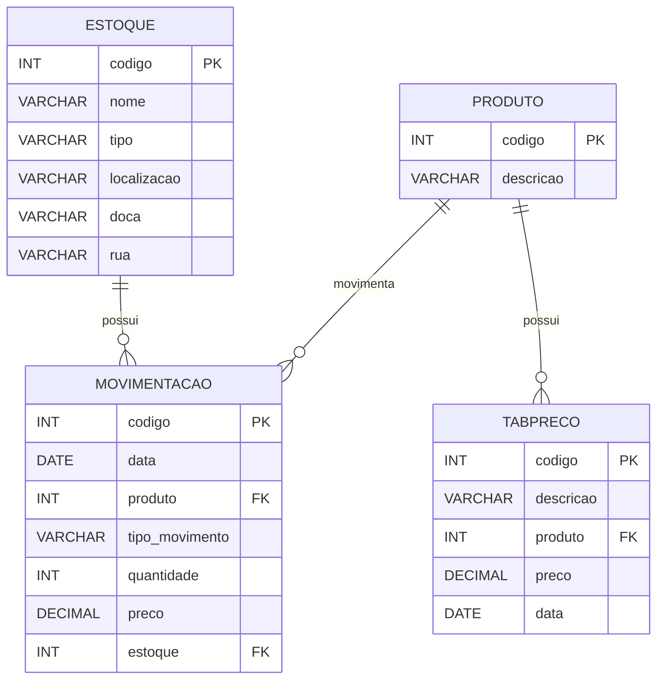

# 📅 10/04/2026

---

## 🗄️ Banco de Dados

---

### 📌 O que é?

Um **banco de dados** é um sistema organizado para armazenar, gerenciar e recuperar informações de forma eficiente.
Ele permite que dados sejam salvos de maneira estruturada e acessados quando necessário.

---

### ⚙️ Como é utilizado?

Os bancos de dados são utilizados em praticamente todos os sistemas:

* Sistemas web (cadastro de usuários, produtos, pedidos)
* Aplicações mobile
* Sistemas corporativos (ERP, controle de estoque)
* Aplicações financeiras e redes sociais

Eles funcionam em conjunto com aplicações, onde:

* o sistema envia comandos
* o banco armazena e retorna os dados

---

### 🔍 Diferença entre `banco de dados`, `SGBD` e `SQL`

* **Banco de dados:** conjunto de dados armazenados
* **SGBD (Sistema Gerenciador de Banco de Dados):** software que gerencia o banco

  * Exemplo: PostgreSQL
* **SQL (Structured Query Language):** linguagem usada para manipular os dados

---

### 🧠 Conceitos gerais:

1. **Tabelas:** estrutura onde os dados são armazenados
2. **Colunas:** definem os atributos (ex: nome, idade)
3. **Linhas:** registros armazenados na tabela
4. **Chave Primária (PK):** identifica unicamente um registro
5. **Chave Estrangeira (FK):** cria relacionamento entre tabelas

---

### 🔗 Relacionamento entre tabelas

* **1 para 1 (1:1):** um registro se relaciona com apenas um outro
* **1 para N (1:N):** um registro se relaciona com vários
* **N para N (N:N):** vários registros se relacionam com vários

---

### 📊 Modelo Entidade-Relacionamento (ER)

O modelo ER é uma forma visual de representar:

* Entidades (tabelas)
* Atributos (colunas)
* Relacionamentos entre tabelas

---

### 📦 Exemplo prático

Sistema de controle de estoque com:

* Produtos
* Estoques
* Movimentações
* Tabela de preços

---

### 🛠️ Instalação do PostgreSQL

1. Acesse o site oficial: https://www.postgresql.org
2. Baixe a versão compatível com seu sistema
3. Execute o instalador
4. Defina:

   * usuário (postgres)
   * senha
   * porta (padrão 5432)
5. Finalize a instalação

---

### 🖥️ Breve apresentação do PgAdmin

O **PgAdmin** é uma interface gráfica para gerenciar o PostgreSQL.

Com ele você pode:

* Criar bancos de dados
* Criar tabelas
* Executar comandos SQL
* Visualizar dados
* Gerenciar usuários

---

### 📐 Diagrama de Entidade-Relacionamento

#### 🏬 Estoque

| Campo       | Tipo    | Descrição                   |
| ----------- | ------- | --------------------------- |
| codigo      | INT     | 🔑 PK - obrigatório e único |
| nome        | VARCHAR | Nome do estoque             |
| tipo        | VARCHAR | Tipo de estoque             |
| localizacao | VARCHAR | Localização                 |
| doca        | VARCHAR | Doca                        |
| rua         | VARCHAR | Rua                         |

---

#### 📦 Produto

| Campo     | Tipo    | Descrição                   |
| --------- | ------- | --------------------------- |
| codigo    | INT     | 🔑 PK - obrigatório e único |
| descricao | VARCHAR | Descrição do produto        |

---

#### 💰 Tabpreco

| Campo     | Tipo    | Descrição                   |
| --------- | ------- | --------------------------- |
| codigo    | INT     | 🔑 PK - obrigatório e único |
| descricao | VARCHAR | Descrição                   |
| produto   | INT     | 🔗 FK para Produto          |
| preco     | DECIMAL | Valor                       |
| data      | DATE    | Data                        |

---

#### 🔄 Movimentação de estoque

| Campo          | Tipo    | Descrição                   |
| -------------- | ------- | --------------------------- |
| codigo         | INT     | 🔑 PK - obrigatório e único |
| data           | DATE    | Data                        |
| produto        | INT     | 🔗 FK para Produto          |
| tipo_movimento | VARCHAR | Entrada ou Saída            |
| quantidade     | INT     | Quantidade                  |
| preco          | DECIMAL | Preço                       |
| estoque        | INT     | 🔗 FK para Estoque          |

---

### 🔗 Relacionamentos

* Um **Produto** pode ter vários preços (1:N)
* Um **Produto** pode ter várias movimentações (1:N)
* Um **Estoque** pode ter várias movimentações (1:N)

---

### 📊 Diagrama (Mermaid)

---
