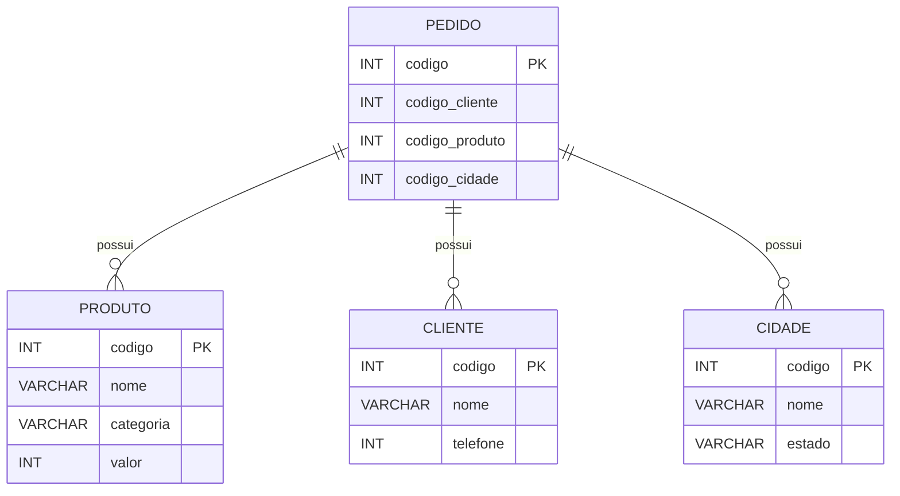

```mermaid
erDiagram

    PEDIDO ||--o{ PRODUTO : possui
    PEDIDO ||--o{ CLIENTE : possui
    PEDIDO ||--o{ CIDADE : possui

    PEDIDO {
        INT codigo PK
        INT codigo_cliente
        INT codigo_produto
        INT codigo_cidade
    }

    PRODUTO {
        INT codigo PK
        VARCHAR nome
        VARCHAR categoria
        INT valor
    }

    CLIENTE {
        INT codigo PK
        VARCHAR nome
        INT telefone
    }

    CIDADE {
        INT codigo PK
        VARCHAR nome
        VARCHAR estado
    }
```

