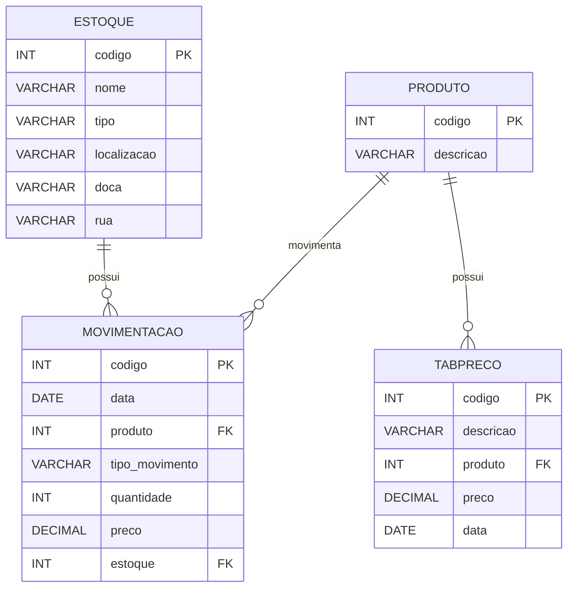

## 📌 Por que normalizar?
- Organizar os dados de forma eficiente
- Evitar redundância (dados duplicados)
- Garantir consistência no banco
- Facilitar manutenção e evolução do sistema

---

## ⚠️ Problemas comuns em modelos "mal" feitos

### 🔹 Inserção
- Dificuldade para inserir dados sem ter todas as informações
- Pode exigir dados desnecessários

### 🔹 Atualização
- O mesmo dado precisa ser atualizado em vários lugares
- Risco de inconsistência

### 🔹 Exclusão
- Ao deletar um dado, pode apagar informações importantes sem querer

---

## 🧩 Regra: dados devem ser atômicos
- Cada campo deve armazenar apenas um valor
- Evita campos com múltiplas informações (ex: "telefone1, telefone2")
- Facilita consultas e manipulação

---

## 🔑 Dependência total da chave primária
- Todos os atributos devem depender da chave primária completa
- Remove dependências parciais
- Importante quando há **chave composta**

---

## 🔄 Regra: eliminar dependências transitivas
- Um atributo não deve depender de outro atributo que não seja a chave primária
- Ex: cidade depende do CEP, não do ID diretamente
- Evita redundância e inconsistência

---

## ⚖️ Desnormalização
- Uso intencional de redundância
- Pode melhorar desempenho (menos joins)
- Deve ser feita com cuidado
- Muito usada em sistemas grandes e relatórios

---

## 📐 Diagrama de Entidade-Relacionamento

#### 🏬 Estoque

| Campo       | Tipo    | Descrição                   |
| ----------- | ------- | --------------------------- |
| codigo      | INT     | 🔑 PK - (NN)obrigatório e único |
| nome        | VARCHAR | Nome do estoque             |
| tipo        | VARCHAR | Tipo de estoque             |
| localizacao | VARCHAR | Localização                 |
| doca        | VARCHAR | Doca                        |
| rua         | VARCHAR | Rua                         |

---

#### 📦 Produto

| Campo     | Tipo    | Descrição                   |
| --------- | ------- | --------------------------- |
| codigo    | INT     | 🔑 PK - (NN)obrigatório e único |
| descricao | VARCHAR | Descrição do produto        |
| Código_tabpreco| INT| FK                          |

---

#### 💰 Tabpreco

| Campo     | Tipo    | Descrição                   |
| --------- | ------- | --------------------------- |
| codigo    | INT     | 🔑 PK - obrigatório e único |
| descricao | VARCHAR | Descrição                   |
| produto   | INT     | 🔗 FK para Produto          |
| preco     | DECIMAL | Valor                       |
| data      | DATE    | Data                        |

---

#### 🔄 Movimentação de estoque

| Campo          | Tipo    | Descrição                   |
| -------------- | ------- | --------------------------- |
| codigo         | INT     | 🔑 PK - obrigatório e único |
| data           | DATE    | Data                        |
| produto        | INT     | 🔗 FK para Produto          |
| tipo_movimento | VARCHAR | Entrada ou Saída            |
| quantidade     | INT     | Quantidade                  |
| preco          | DECIMAL | Preço                       |
| estoque        | INT     | 🔗 FK para Estoque          |

---

### 🔗 Relacionamentos

* Um **Produto** pode ter vários preços (1:N)
* Um **Produto** pode ter várias movimentações (1:N)
* Um **Estoque** pode ter várias movimentações (1:N)

---

### 📊 Diagrama (Mermaid)

---